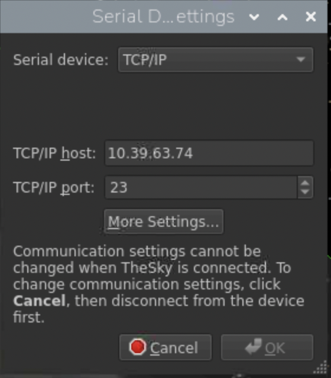
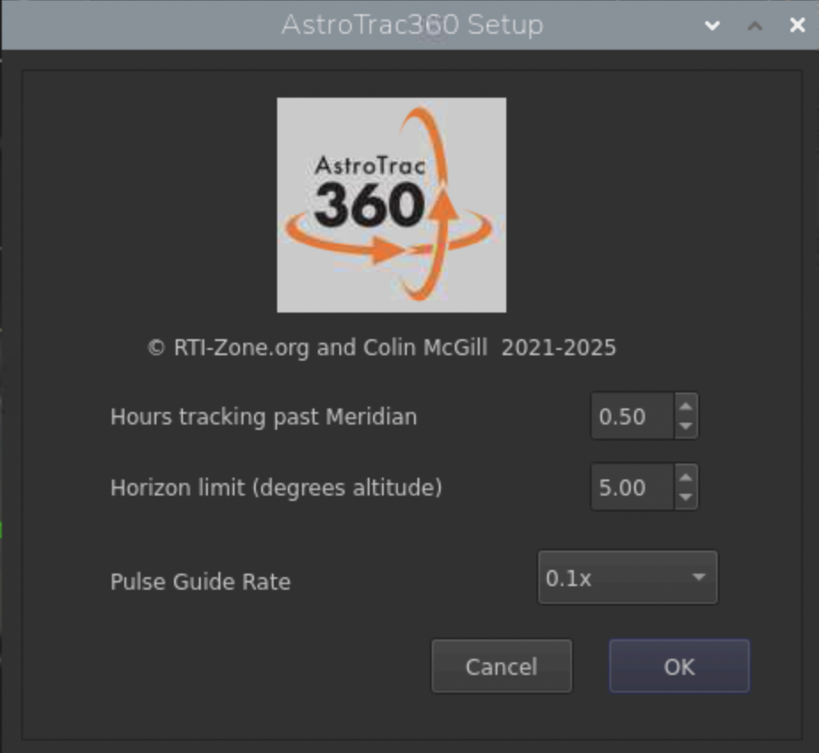

# AstroTrac X2 Driver

An X2 plugin for controlling an AstroTrac360 mount from TheSky.

## Key changes in 2.0

- **More robust, better-optimised communication with the mount.** Fixed a
  reentrant-locking deadlock risk in the mutex coverage around every call into
  the mount communication layer. Replaced the unreliable per-byte read timeout
  with a poll-and-batch-read approach, and tuned the retry/timeout constants
  from measured hardware data - see the recommendations below for further
  steps you can take to improve reliability.
- **Firmware-level post-meridian and horizon safety backstop.** The driver can
  now send its meridian and horizon safety limits to the mount firmware
  (2.35 and later) as a backstop, so tracking still stops safely even if TheSky 
  hangs or the connection to the mount is lost. See **Driver settings** below.

## Periodic comms stalls: root cause found and fixed (firmware 2.40+)

If you've experienced periodic communication stalls with the mount - usually
seen as an occasional **"command failed"** error from the driver, or, if
you're using PulseGuide for autoguiding, TheSky reporting **"Autoguider
stopped unexpectedly"** - the root cause has been identified: the mount's RA
and DEC drives each run their own on-board Wi-Fi access point, and by default
both used to sit on channel 1, which is also the busiest/most commonly used
channel for nearby routers and other Wi-Fi devices. From firmware 2.40
onward, RA (the drive your device actually connects to) has been moved to
channel 6, with DEC on channel 1. This has been validated clean over many
hours of imaging under a deliberately aggressive stress test
(fastest-possible tracking, focuser, and guiding polling all running
simultaneously at once) with zero comms stalls.

**Updating to firmware 2.40 or later should resolve most periodic stall
issues.** That said, channel 6 isn't guaranteed to be clear in every
environment - if something else nearby (another router, a neighbour's
network) happens to be busy on or near channel 6 at your specific location,
you could still see occasional issues. If that happens, the two workarounds
below remain useful as additional mitigation - they reduce the impact of any
residual retransmissions rather than addressing the root cause, but combined
with the firmware fix they should cover almost any situation.

**A note on firmware versions:** the driver-side reliability work (mutex
fixes, retry/timeout tuning, stale-reply recovery) works with the currently
released firmware (2.25) and needs no firmware update at all. The
firmware-level safety backstop described in **Driver settings** below needs
firmware 2.35+, and the Wi-Fi channel fix described here needs firmware
2.40 - both of these are still being evaluated by AstroTrac ahead of release
and aren't yet publicly available.

## Connecting to the mount

TheSky's serial-device dialog is used to point the driver at the mount, even
though the connection is actually TCP/IP rather than a physical serial port:



- **Serial device**: set to `TCP/IP`.
- **TCP/IP host**: the mount's IP address on your network. **Replace the example
  address shown here with your own mount's actual IP** - your AstroTrac360 generates
  its own unique IP address, derived from its Wi-Fi chip's MAC address.
- **TCP/IP port**: `23` (this is the AstroTrac360's control port).

These settings can only be changed while disconnected - click **Cancel** first if
TheSky is currently connected to the mount.

Click **More Settings...** in this same dialog to open the driver's own settings
(below).

## Driver settings

Reached via **More Settings...** in the Serial Device Settings dialog above:



- **Hours tracking past Meridian**: how long the mount is allowed to keep
  tracking past the meridian before the driver stops it. This is a software
  safety limit enforced in the driver. The driver will also set a firmware limit
  (firmware 2.35 and later) as a backstop in case TheSky hangs or the connection
  to the mount fails. The firmware backstop will operate 12 minutes after
  the driver should act.
- **Horizon limit (degrees altitude)**: the altitude below which the driver
  stops tracking, enforced the same way. The X2 driver should operate first, with
  a firmware backstop set 3 degrees lower.
- **Pulse Guide Rate**: the guide rate (as a fraction of sidereal) used for
  autoguiding pulses sent via `PulseGuide`/`OpenLoopMove`. `0.1x` is recommended
  by Richard Taylor who designed AstroTrac360 - note that you will need a longer
  guiding calibration time (25 seconds) to get sufficient movement for a good
  calibration.

## Recommended: reduce retransmission timeout on a Raspberry Pi

If you're still seeing occasional comms issues after updating to firmware
2.40+ (see above), this and the next recommendation help reduce their impact
further.

When tested on a Raspberry Pi 5, more than 99.9% of commands to the mount were 
transmitted in less than 10ms. However, if there was a problem and a data packet
had to be re-transmitted, there were delays of 220ms. This is because the 
Raspberry Pi 5 has a default re-transmission time of 200ms. Lowering this limit
to 20ms reduced the number of times this happened by a factor of 10. Combined
with setting the cross hair update interval below, the maximum delay was reduced to 50ms.

To reduce this on a Raspberry Pi, create a NetworkManager dispatcher script. This
specifies that the sepcific route to the AstroTrac360 should have a lower `rto_min` 
(retransmission time):


```bash
sudo tee /etc/NetworkManager/dispatcher.d/99-device-rto <<'EOF'
#!/bin/bash
IFACE="$1"
ACTION="$2"

if [ "$IFACE" = "wlan1" ] && [ "$ACTION" = "up" ]; then
    ip route add 10.39.63.74 dev wlan1 rto_min 20ms 2>/dev/null
fi
EOF
sudo chmod +x /etc/NetworkManager/dispatcher.d/99-device-rto
```

**Before using this, change two things to match your own setup:**

- `10.39.63.74` - replace with your mount's actual IP address (the same one
  entered in TheSky's Serial Device Settings above).
- `wlan1` - replace with whichever network interface your Pi actually uses to
  reach the mount. Run `nmcli device status` (or `ip addr`) on the Pi to see
  the interface names available - it may be `wlan0` rather than `wlan1`,
  particularly on a Pi with only one Wi-Fi adapter.

The script only fires on the next `up` event for that interface, so reconnect
the Wi-Fi interface (or reboot the Pi) after installing it. To confirm it took
effect, run `ip route show` on the Pi and check that the route to the mount's
IP shows the custom `rto_min`.

This is a Pi/Linux-side network tuning change, not part of the driver itself -
it doesn't require a new build, and it's safe to try independently of which
driver version is installed.

## Recommended: set TheSky's cross hair update interval to 500ms

In TheSky's mount setting dialogue, set the cross hair update interval to 500ms. 
The default is as soon as possible - in the AstroTrac360's case, this will be about
300 times a second. That volume of traffic can cause communication problems about
0.02% of the time. In turn this can cause unreliable pulse guide timings. Reducing 
the cross hair update interval and reducing the retransmission time as suggested
above will reduce the maximum time to send a command to 50ms. At 0.1 siderial
this will result in maximum pulseguide error of less than 0.1" which is 
insignificant.

## Changelog (v2.0 to now)

- **2.0**: Audited and fixed mutex coverage around every call into the mount
  communication layer, including a reentrant-locking deadlock risk. Rewrote
  the read path to poll for waiting bytes and batch-read instead of relying
  on an unreliable per-byte timeout, and tuned the retry/timeout constants
  from measured hardware data. Added the firmware-level post-meridian/horizon
  safety backstop (firmware 2.35+) as the headline new capability.
- **2.01**: Name the debug log after the observing night (noon-to-noon,
  matching TheSky's own guide-log folder naming) instead of a fixed
  filename, appending `_v2`/`_v3`/... if a log for that night already
  exists, so a second connection no longer silently overwrites the first.
- **2.02**: Recover a matching reply already sitting at the end of a stale
  reply backlog (delayed responses can arrive bunched together after a
  comms stall) instead of discarding the whole buffer and forcing an
  unnecessary resend once retries are exhausted.
- **2.03**: Give only the last retry a long (1.6s) timeout instead of
  raising every attempt - rides out the multi-second comms stalls seen in
  the field without slowing down genuine-failure detection or piling up
  extra resends. Also added millisecond precision to the debug log's
  timestamps, so log times can be used directly for timing analysis.

